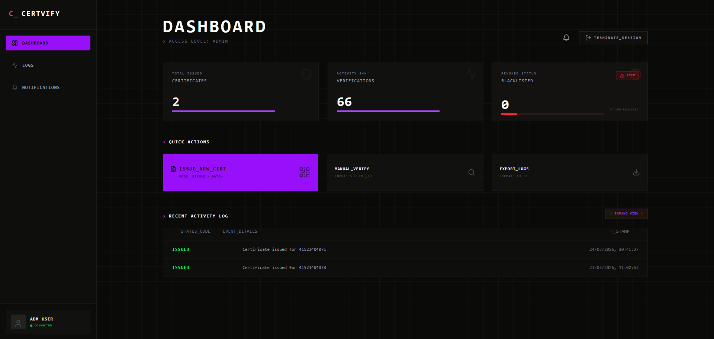
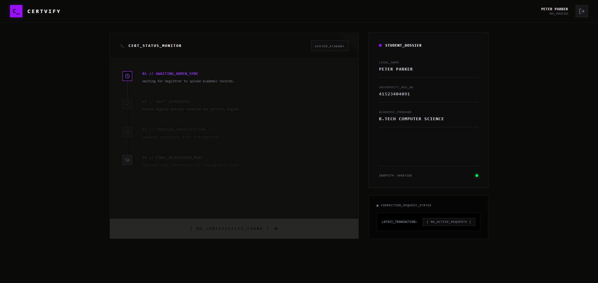
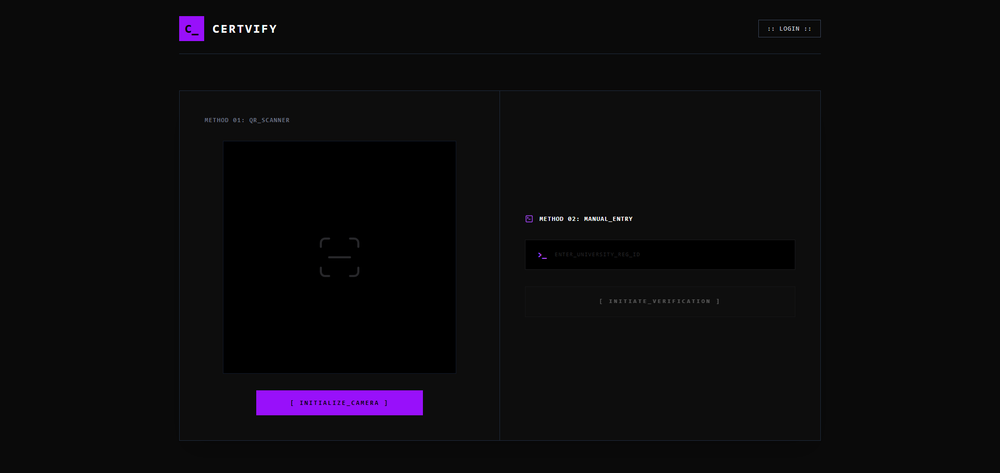
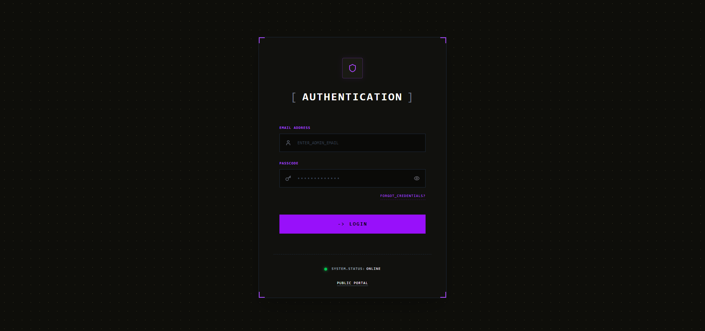

# 🛡️ Certvify - Secure Credentialing Platform (Frontend)

This repository contains the frontend client for **Certvify**, an enterprise-grade, cryptographically secure credential issuance and verification system. Built with React and Vite, it interfaces with our Node.js RSA-SHA256 cryptographic backend to guarantee the authenticity of academic records.

## ✨ Core Features

* **🔐 Admin Dashboard:** Secure interface for authorized personnel to issue, manage, and revoke student credentials.
* **📱 Live QR Verification:** Integrated camera scanner allowing recruiters to instantly verify physical certificates via dynamically generated QR codes.
* **⚡ Cryptographic Validation:** Real-time visual feedback (Green/Red states) based on public-key RSA signature decryption and SHA-256 hash matching.
* **🎨 Responsive Design:** Mobile-first architecture built with Tailwind CSS, ensuring perfect rendering across desktops, tablets, and smartphones.
* **🚀 Edge-Ready Routing:** Pre-configured `vercel.json` for seamless React Router integration on static hosting.

## 🛠️ Tech Stack

* **Core:** React 18, Vite
* **Styling:** Tailwind CSS
* **Routing:** React Router DOM
* **HTTP Client:** Axios
* **Utilities:** `qrcode.react` (QR Generation), `react-qr-reader` (Scanning)

 -->
## 📸 Screenshots

  <b>Admin Dashboard</b>&nbsp;&nbsp;&nbsp;&nbsp;&nbsp;&nbsp;&nbsp;&nbsp;<b> Student Dashboard</b>

  
  

 

  <b>Landing Page</b>&nbsp;&nbsp;&nbsp;&nbsp;&nbsp;&nbsp;&nbsp;&nbsp;<b>Admin Login</b>

  
  

<!-- 

